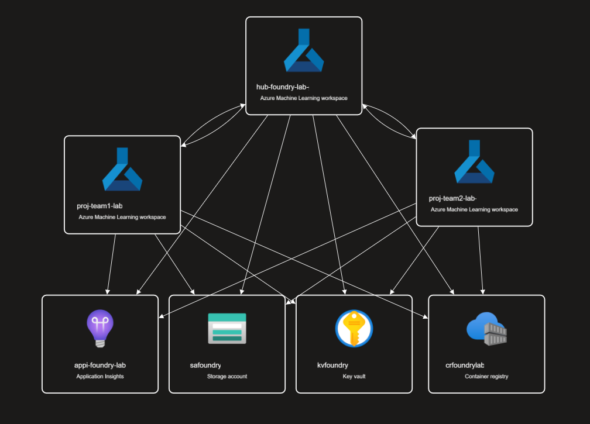
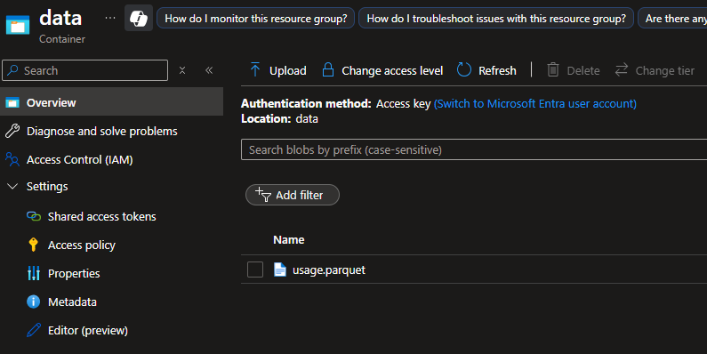

## Deployment: Azure AI Foundry and Dependencies


This section provides a detailed guide for deploying Azure AI Foundry and the associated dependencies required for the workshop. We will walk you through the necessary prerequisites and the steps to successfully configure your environment.

You will clone the repository, deploy the solution using either PowerShell or Bash, and set up the essential resources needed to implement multi-agent systems.

#### Key Resources Deployed:
- **Azure AI Foundry** components: AI Service, AI Hub, Projects, and Compute  
- **Azure AI Search** for knowledge retrieval and vector-based search  
- **Azure Storage Account** for document storage and data ingestion  
- **Azure Functions** for event-driven document chunking, embedding generation, and indexing  
- **Azure Web App** to enable agent interactions via OpenAPI and GraphQL integrations

--- 

### **Prerequisites**
Before diving into deployment, make sure you have the following prerequisites in place to ensure a smooth setup:
- ✅ **Azure Subscription:** Active subscription with sufficient privileges to create and manage resources.  
- ✅ **Azure CLI:** Install the [Azure CLI](https://learn.microsoft.com/en-us/cli/azure/get-started-with-azure-cli) for managing Azure resources.  
- ✅ **IDE with Bicep & PowerShell Support:** Use [VS Code](https://code.visualstudio.com/download) with the **Bicep extension** for development and validation.  

---

### 1. Clone the Repository
Clone the repository to your local machine and navigate into the project directory:

```bash
git clone https://github.com/jonathanscholtes/azure-ai-foundry-agentic-workshop.git

cd azure-ai-foundry-agentic-workshop
```


### 2. Configure Azure AI Projects and Assign Users

This workshop enables the deployment of multiple Azure AI Projects and can automatically assign participants the `AI Developer` role for each project.

#### Steps:

1. Duplicate the `project_resource_config_sample.json` file and rename it to `project_resource_config.json`.
2. Update the file with the following:
   - Specify the desired project names.
   - Set the number of compute instances to deploy for each project. *(Note: Compute instances are technically created within the AI Hub, but they will be named to align with the project for convenience.)*
   - *(Optional)* Add a `users` array for each project to assign the `AI Developer` role. If the `users` property is omitted, no users will be assigned roles for that project - but can be assigned later.

#### Example `project_resource_config.json`:

```json
[
  {
    "projectName": "team1",
    "devComputeInstances":1,
    "users": [
    {
      "user": "johndoe@example.com",
      "objectId": "9e3c74f9-0131-4ab7-a18e-8d0a833b8f5d"
    }
  ]
  },
  {
    "projectName": "team2",
    "devComputeInstances":1,
    "users": [
    {
      "user": "johndoe@example.com",
      "objectId": "9e3c74f9-0131-4ab7-a18e-8d0a833b8f5d"
    },
    {
      "user": "johnsmith@example.com",
      "objectId": "b0c1f2d4-ff62-4a49-b158-6e4b99b464a9"
    }
  ]
  },
  {
    "projectName": "team3",
    "devComputeInstances":0
  }
]
```

### 3. Deploy the Solution  


#### 🔹 PowerShell (Windows)

Run the following PowerShell command to deploy the solution. Replace the placeholders with your actual subscription name and Azure region. The `-ResourceGroupName` flag is optional for deploying to an exising Azure Resource Group. 

By default, this workshop deploys the following models:  
- **GPT-4o** (required for agents)  
- **text-embedding-ada-002** (required for embeddings)  
- **o1-mini** (optional)  

To skip model deployment, use the `SkipModels` flag. However, you’ll need to manually provision a text embedding model and a chat completion model in Azure OpenAI to run the sample code.

🔗 [Deploy Azure Open AI Model](https://learn.microsoft.com/en-us/azure/ai-foundry/how-to/deploy-models-openai)

The default environment variables expect a deployed text embedding model named `text-embedding` (this name can be customized as needed).

🔗 [Embedding Models](https://learn.microsoft.com/en-us/azure/ai-services/openai/concepts/models?tabs=global-standard%2Cstandard-chat-completions#embeddings)


```powershell
.\deploy.ps1 -Subscription '[Subscription Name]' -Location 'eastus2' -SkipModels [Optional flag] -ResourceGroupName '[Name of existing resource group (optional)]' 
```

#### 🔹 Bash (Linux)

Run the following commands in your terminal to deploy the solution.
Make sure the deployment script is executable and that you're authenticated with Azure.
The third argument (resource group name) is optional.

```bash

# Make the script executable
chmod +x deploy.sh

# Authenticate with Azure
az login
# or use
az login --identity

# Set the active subscription
az account set --subscription '[Subscription Name]'

# Deploy the solution to the secified Location, with DevComputeInstances
./deploy.sh 'eastus2' '[Existing Resource Group Name (optional)]' [--skip-models (optional)]
```

✅ This script provisions all required Azure resources based on the specified parameters. The deployment may take up to **40 minutes** to complete.

The deployment will automatically create all necessary resources for Azure AI Foundry, including Hub and Project configurations, along with any required dependency connections.



### 4. 📥 Upload Structured Data for Agent Integration

Once the deployment is complete, you'll need to update the sample dataset for agent integration. Ensure the user has the `Storage Blob Data Contributor` role to upload the sample data to the Azure Storage Account.

#### Steps:

1. Upload the **parquet** data file to the `data` container in your Azure Storage Account.
    - This demonstration uses synthetic data related to data center energy usage.  
    [📄usage.parquet](../data/usage.parquet)




  