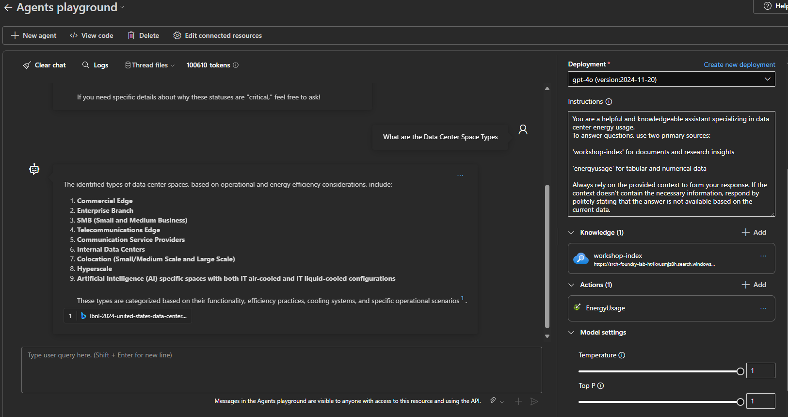

## 🚀 Explore Sample Notebooks

These notebooks show how to build intelligent, agent-powered applications using **Azure AI Foundry**, **Azure AI Search**, and the **Azure AI Agent Service**. You’ll explore:

- 🔍 **Vector Search** & **RAG** for grounding responses  
- 🤖 **Agentic AI** with **LangGraph**, **Semantic Kernel** and **Azure AI Agent Service** for orchestrating workflows  
- 🔗 **OpenAPI** and **GraphQL** integration for real-time actions  
- 🧭 **Tracing** for step-by-step visibility into agent behavior  

From simple chat agents to complex, multi-step interactions, these examples help you deliver smart, context-aware AI—fast.


---

###  Optional: Enhance Your Dev Experience with a VS Code Container

You can run these notebooks directly on your Azure AI Foundry compute instance. For a more integrated development experience, spin up a **VS Code dev container** inside your project. This gives you a fully configured environment with built-in support for the Azure AI CLI, preloaded dependencies, and seamless GitHub integration.

#### Quick Start:

1. In your **Azure AI Project**, go to **Templates** and select **VS Code Compute**.
2. Start your compute instance and click **Set up Container**.

   > ⏳ This setup may take a few minutes to complete.


3. Once it’s ready, you’ll see a green **Ready** status.


4. From the dropdown menu, launch **VS Code (Web)** to open your dev container right in the browser.


---

## 📥 Download Workshop Notebooks

Once your environment is up and running, you can download the sample notebooks directly from the GitHub repository using the following commands:

```bash
# Clone the repository without checking out all files
git clone --no-checkout https://github.com/jonathanscholtes/azure-ai-foundry-agentic-workshop.git

# Navigate into the repo folder
cd azure-ai-foundry-agentic-workshop

# Enable sparse checkout to download only the notebooks folder
git sparse-checkout init --cone
git sparse-checkout set src/Notebooks

# Checkout the selected content
git checkout
```

This approach downloads only the relevant [src/Notebooks](../src/Notebooks) directory, keeping your workspace clean and lightweight.

---

### ⚙️ Configure Your Environment

To connect your notebooks to your Azure AI resources, create a .env file with your specific service credentials.

#### Steps:

1. Copy `sample.env` to a new file named `.env`
2. Replace the placeholder values with your Azure resource info:

```
# Azure AI Search
AZURE_AI_SEARCH_ENDPOINT='Your Azure AI Search Endpoint'
AZURE_AI_SEARCH_KEY='Your Azure AI Search Key'
AZURE_AI_SEARCH_INDEX='workshop-index'

# Azure Storage
AZURE_STORAGE_CONNECTION_STRING='Your Storage Account Connection String for testing Pandas Dataframe Agents'

# Azure OpenAI
AZURE_OPENAI_EMBEDDING='text-embedding'
AZURE_OPENAI_API_VERSION='2024-06-01'
AZURE_OPENAI_ENDPOINT='Endpoint from deployed Azure AI Service or Azure OpenAI Service'
AZURE_OPENAI_API_KEY='Key from deployed Azure AI Service or Azure OpenAI Service'
AZURE_OPENAI_MODEL='gpt-4o'

# Azure AI Project
AZURE_AI_PROJECT_CONNECTION_STRING='Your Azure AI Project Connection String'

# API Endpoints
OPENAPI_URL='Endpoint to deployed API openAPI json schema - https://api-foundry-lab-[random].azurewebsites.net/openapi.json'
GRAPHQL_URL='Endpoint to deployed GraphQL - https://api-foundry-lab-[random].azurewebsites.net/graphql'

# MCP Servers
MCP_WEATHER_SERVER_URL='https://mcp-weather-lab-[random].azurewebsites.net'
```

--- 

### 📓 Notebooks

#### LangGraph Agents  
This collection of notebooks showcases how to build and orchestrate AI agents using [LangGraph](https://langchain-ai.github.io/langgraph/), a powerful low-level orchestration framework designed for building controllable, stateful, and multi-step agent workflows. LangGraph provides the flexibility needed to define deterministic agent behavior, integrate tools, and support dynamic memory and decision-making.

These samples are built using **Azure AI Foundry** and demonstrate practical patterns for deploying and testing intelligent agents at scale.

1. **Single Chat Agent**  
   *Notebook: `langchain_01-azure-ai-agent`*  
   This notebook demonstrates a basic conversational agent connected to deployed Azure AI resources (AI Services and model) for interactive chat capabilities.

   🔗 [Tracing in Azure AI Foundry](https://learn.microsoft.com/en-us/azure/ai-foundry/how-to/develop/langchain#tracing)
   
   

2. **Single Agent with Tools**  
   *Notebook: `langchain_02-azure-ai-agent-tools`*  
   This example extends the basic agent by introducing tool integration, enabling the agent to call simple functions and enhance its behavior during conversations.

   

3. **Multi-Agent Supervisor**  
   *Notebook: `langchain_03-azure-ai-rag-agent`*  
   This notebook extends the agentic architecture by introducing a **supervisor agent** that coordinates multiple agents. It leverages vectorized data from **Azure AI Search** to ground responses and enhance task orchestration.

   🔗 [LangGraph Multi-agent Supervisor](https://langchain-ai.github.io/langgraph/tutorials/multi_agent/agent_supervisor/)

   

4. **Multi-Agent Supervisor with OpenAPI Integration**  
   *Notebook: `langchain_04-azure-ai-rag-agent_openapi`*  
   This notebook enhances the multi-agent supervisor architecture by incorporating the ability to call external APIs via an OpenAPI specification. It combines vectorized retrieval from **Azure AI Search** with real-time data access, such as energy usage metrics from a data center, to deliver grounded and actionable responses. This demonstrates how agents can orchestrate tasks that span both unstructured and structured data sources.

   

5. **Multi-Agent, Multi-Tool Supervisor with GraphQL Integration**  
   *Notebook: `langchain_05-azure-ai-rag-agent_graphql`*  
   This notebook expands the multi-agent supervisor framework by integrating multiple tools, including temperature conversion and real-time weather retrieval. It combines document retrieval using **Azure AI Search** with dynamic querying of data center energy usage via a GraphQL endpoint. This showcases how agents can coordinate across diverse tools and data sources—both structured and unstructured—to deliver enriched, context-aware responses.

   

6. **Multi-Agent Subgraphs for Reuse and Complex Systems**  
   *Notebook: `langchain_06a-azure-ai-rag-agent_subgraph`*  
   This notebook showcases a multi-agent pattern that uses **subgraphs** to encapsulate agent workflows into independent, reusable components. These subgraphs can be composed and orchestrated across complex systems, enabling modular design and improved maintainability.

   🔗 [Subgraphs in LangGraph](https://langchain-ai.github.io/langgraph/concepts/low_level/#subgraphs)


   

7. **Multi-Agent Subgraphs for Dynamic Data Query and Code Execution**  
   *Notebook: `langchain_07a-azure-ai-agent_dataframe`*  
   This notebook demonstrates how to use a subgraph to write and execute a query against a structured data source. In this example, a Parquet file stored in an Azure Storage Account is used. The agent generates Python code to filter a pandas DataFrame and extract the relevant data to answer user queries.

   

#### Semantic Kernel Agents  

This section highlights how to build AI agents using the [Semantic Kernel](https://learn.microsoft.com/en-us/semantic-kernel/) framework. Semantic Kernel is a lightweight SDK for integrating AI services into applications, with native support for function calling, memory, planners, and plugins. These capabilities allow you to embed agentic patterns into any app with high flexibility and control.

These notebooks, powered by **Azure AI Foundry**, showcase practical patterns for building and deploying intelligent agents using Semantic Kernel.

1. **Agent Plugins with Function Calling**  
   *Notebook: `semantic-kernel_01-azure-ai-agent-plugins`*  
   This notebook demonstrates how to use Semantic Kernel Plugins to enable agents to perform complex tasks through function calling. It shows how to register and invoke custom plugins that extend the agent’s capabilities, allowing integration with APIs, tools, or business logic.

   🔗 [Configuring Agents with Semantic Kernel Plugins](https://learn.microsoft.com/en-us/semantic-kernel/frameworks/agent/agent-functions?pivots=programming-language-python)

 
<br/>

2. **RAG Agent with Plugins**  
   *Notebook: `semantic-kernel_02-azure-ai-rag-agent`*  
   This notebook demonstrates how to build a Retrieval-Augmented Generation (RAG) agent by combining Semantic Kernel plugins with function calling and vector search using **Azure AI Search**. The result is an intelligent agent capable of grounding its responses in enterprise knowledge for more accurate and context-aware interactions.


#### Azure AI Agent Service  

The [Azure AI Agent Service](https://learn.microsoft.com/en-us/azure/ai-services/agents/overview) is a **fully managed agent orchestration platform** that enables developers to build and deploy intelligent agents powered by OpenAI models—without needing to manage infrastructure, model endpoints, or tool execution environments.

It simplifies the creation of **context-aware, tool-using agents** by offering first-class support for OpenAPI, Azure AI Search, function calling, and structured memory.

1. **Agent with OpenAPI Tooling**  
   *Notebook: `azure_ai_agent_01-openapi`*  
   This notebook demonstrates how to create and register an Azure AI Agent that connects to an external system via an **OpenAPI 3.0 tool definition**. This approach enables real-time data access from structured APIs—such as energy usage metrics, service alerts, or device statuses—directly into the agent’s decision loop.

   🔗 [Azure AI Agent Service with OpenAPI Specified Tools](https://learn.microsoft.com/en-us/azure/ai-services/agents/how-to/tools/openapi-spec?tabs=python&pivots=overview)


---

### 🧠 Build Smart, Actionable AI with Azure AI Agent Service (Portal)

The [Azure AI Agent Service](https://learn.microsoft.com/en-us/azure/ai-services/agents/overview) is a fully managed platform designed to help developers create intelligent, context-aware agents—without the overhead of managing compute or storage infrastructure. These agents are extensible, secure, and capable of reasoning over documents and interacting with external APIs.

In this walkthrough, you'll build an AI agent that performs two key tasks:
- Retrieves contextual information from **Azure AI Search**
- Executes real-time actions via an **OpenAPI** endpoint to surface structured data like energy usage from a data center

---

#### ⚙️ Step-by-Step: Creating a New Azure AI Agent

Let’s walk through how to set up an agent that combines knowledge retrieval and dynamic API interaction.


##### 1. Create a New Agent

In your **AI Project** within Azure AI Foundry, navigate to the **Agents** section and click **+ Create Agent**.


---

##### 2. Define Your Agent’s Role and Instructions

Provide your agent with a clear name and set of instructions. Here’s an example configuration:

> You are a helpful and knowledgeable assistant specializing in data center energy usage.  
> Use two primary sources to answer questions:  
> - `workshop-index` for documents and research insights  
> - `energyusage` for tabular and numerical data  
> Always use the available context when forming a response. If the information is not found, politely inform the user that the answer isn’t currently available.


---

##### 3. Add a Knowledge Source

To enable contextual awareness, add **Azure AI Search** as a knowledge source. This allows the agent to pull insights directly from your indexed documents.


- Click **+ Add** under **Knowledge**
- Select **Azure AI Search**
- Use an existing index or connect a new one via your Azure AI Search connection

---

##### 4. Add an Action via OpenAPI

Let’s give your agent the power to call an API. This could be to retrieve structured data or even trigger external workflows.


- Click **+ Add** under the **Actions** section
- Select **OpenAPI-specified tool**


- Provide a meaningful **name** and **description** for your tool


To retrieve and apply your OpenAPI schema:

1. Visit the API documentation:  
   `https://api-foundry-lab-[random].azurewebsites.net/docs` - _replace with your deployed endpoint url_
2. Click on **/openapi.json**
3. Copy the full JSON schema
4. Paste it into the tool creation window


---

##### 5. 🧪 Test the Agent in Playground

Once your agent is configured with both knowledge and actions, test it using the **Playground** feature.


Try asking:

> **"What data centers are in 'critical'?"**  
The agent will use the OpenAPI action to retrieve structured usage data.


Or:

> **"What are the Data Center Space Types?"**  
This will perform vector-based retrieval over your indexed documents in Azure AI Search.



---

By combining the best of vector search and API-based action execution, you're creating intelligent agents that don’t just talk—they **do**.
