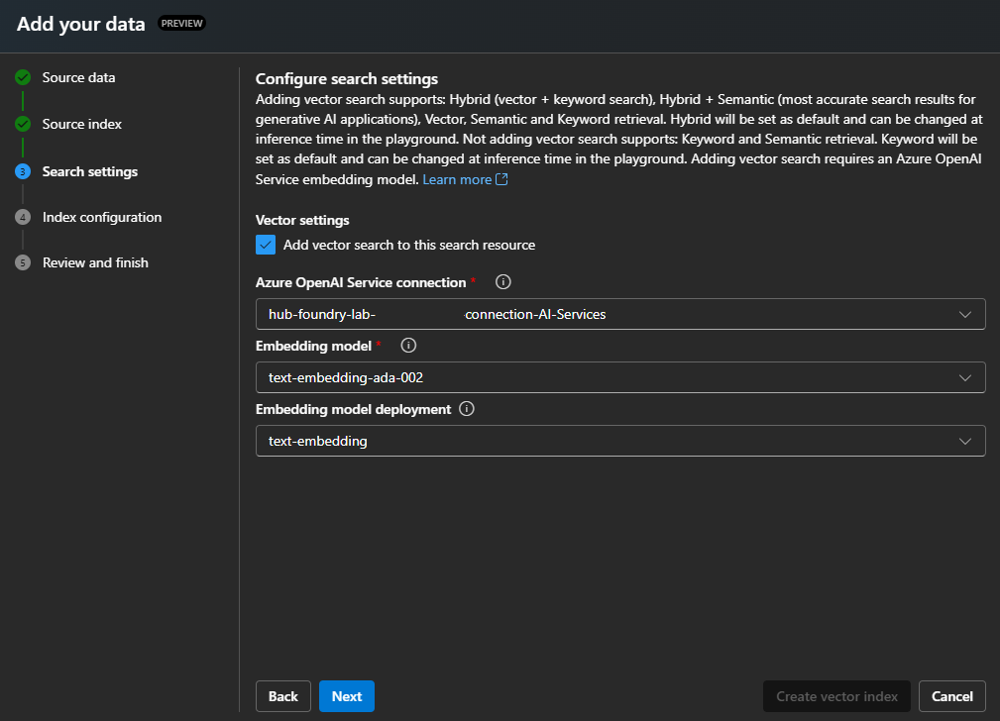

## Vector Search and RAG Setup

Instructions for processing documents, creating embeddings using **Ada-002**, indexing them into **Azure AI Search**, and configuring **RAG** for semantic retrieval.

### Prerequisites

- ✅ **Workshop Deployment**  
  Ensure the workshop environment and all required services (AI Foundry, Storage Account, and Azure AI Search) are deployed.  
  ➤ [**Workshop Setup and Solution Deployment**](deployment.md)

---
### Resources

This project implements Azure AI Search **push APIs** as the recommended method for indexing large documents, controlling execution and to use event driven indexing. For more details, refer to:  
[Indexing Large Data Sets in Azure AI Search](https://learn.microsoft.com/en-us/azure/search/search-how-to-large-index)  

Furthermore, the document chunking strategies utilized in this project are outlined in:  
[Chunking Large Documents for Vector Search in Azure AI Search](https://learn.microsoft.com/en-us/azure/search/vector-search-how-to-chunk-documents)

---

### Indexing Data with Azure AI Search

In Azure AI Search, queries run against content loaded into a search index. There are two primary ways to populate an index:  
1. **Push** your data programmatically using APIs  
2. **Pull** data in using a search indexer

#### 🔄 Push Data Using Azure AI Search APIs

The push model uses APIs to upload documents directly into an existing search index.

##### Key Benefits

- **Flexible Data Sources**  
  You can index content from any source, as long as it’s formatted as JSON and matches your index schema.

- **Unlimited Update Frequency**  
  Push updates as often as needed—ideal for real-time use cases like syncing product inventory or other rapidly changing data.

- **Full Control over Connectivity and Security**  
  You define how documents are accessed and secured. Unlike indexers, which rely on built-in Azure AI Search authentication, the push model gives you end-to-end control.

#### ⚙️ Indexing Documents via Azure Function

This project includes the Azure Durable Function [`DocumentProcessingFunction`](src/DocumentProcessingFunction), which listens for new PDF files in blob storage and automatically processes and indexes them into Azure AI Search.

- **Authentication** is managed via **Azure Managed Identities**, offering a secure alternative to API keys.

##### 📥 Upload Documents for Indexing

To trigger indexing:

1. Upload PDF documents to the `load` container in the Azure Storage Account.
2. The Azure Function will automatically:
   - Chunk the documents
   - Generate embeddings
   - Push the content into your Azure AI Search index

> 💡 Once the Azure Function has successfully processed, chunked, generated embeddings, and indexed the content into Azure AI Search, the uploaded PDF files will be moved to the `completed` container.
---

####  Pull Data with Azure AI Search Indexers

The **pull model** uses indexers that connect to supported data sources and automatically ingest data into your Azure AI Search index. Indexers are available for many Microsoft data sources, with additional support through third-party connectors.

##### Key Benefits of Using Indexers

- **Automated Data Ingestion**  
  Indexers directly connect to structured sources (e.g., tables, views), transforming rows into JSON and uploading them to your index automatically.

- **Simple Field Mapping**  
  Source fields are mapped to index fields with minimal configuration—no need for custom transformation code.

- **Built-In Scheduling**  
  Define how frequently your index is refreshed with built-in scheduling support, ensuring data stays current without manual intervention.

#### ⚙️ Indexing with the Azure AI Search Vectorization Wizard

Azure AI Search offers a **vectorization wizard** that lets you quickly set up an indexing and enrichment pipeline—ideal for chunking and embedding content for vector search.

With minimal setup, the wizard:
- Connects to your data source
- Chunks and vectorizes text or image data
- Uses your deployed embedding model to generate vector content

> 💡 You’ll need an existing embedding model deployment, but the wizard handles the connection, request, and response automatically.

##### 📥 Getting Started with the Vectorization Wizard

1. Sign in to the [Azure portal](https://portal.azure.com).
2. Navigate to your **Azure AI Search** service.
3. From the **Overview** page, select **Import and vectorize data**.

---

### Testing the Vector Index with Azure AI Foundry

To interact with your vector data in **Azure AI Search** through the Playground, add your Azure AI Search index as a data source.

#### 1. **Add Data Source – Azure AI Search Index**
In the Playground, click on **`+ Add a new data source`**.  
  
   

#### 2. **Select AI Search Source Location**
Choose **Azure AI Search** as the data source.  

  

#### 3. **Select AI Search Source Index**
Select the deployed instance of **Azure AI Search** associated with this solution, and choose the index named `_workshop-index_`.  

#### 4. **Select AI Search Settings**
To perform a vector search, specify the text embedding mode.  
   - Select the mode `_text-embedding_`, which is deployed to **Azure AI Foundry** with this solution.

  

#### 5. **Select AI Search Index Settings**
Keep the default settings and proceed to the **Review and Finish** step. 

  

#### 6. **Chat with Azure AI Search Vector Indexes**
With the new data source added, you can now chat with the vector data using the Playground.  
For example, if you uploaded the sample file _2024 United States Data Center Energy 
Usage Report_, you can ask:  **"What is the impact of bitcoin?"**  

